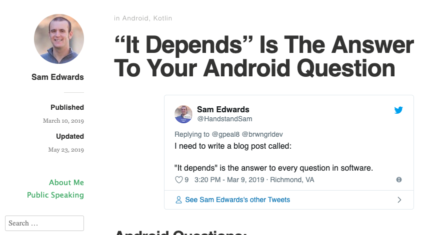
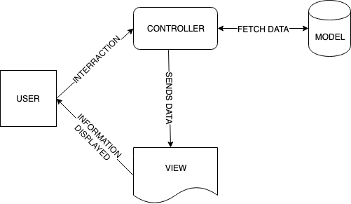
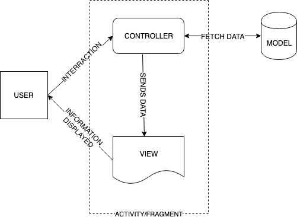
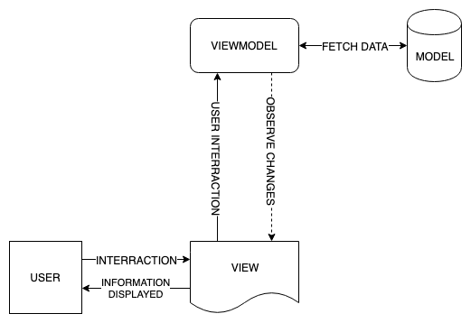

theme: Simple
slidenumbers: true
autoscale: true
footer: @AdamMc331<br/>#AndroidSummit
build-lists: true

## MVWTF: Demystifying Architecture Patterns

### Adam McNeilly - @AdamMc331

---

# You May Have Heard These Buzzwords:

* MVC
* MVP
* MVVM
* MVI
* MVU??

[.build-lists: false]

---

# Why Are There So Many?

---

# What's The Difference?

---

# Which One Should I Use?

---

# Which One Should I Use?



---

# Why Do We Need Architecture Patterns?

---

# More Buzzwords!

* Maintainability
* Extensibility
* Robust
* Testable

---

# Let's Start With One Simple Truth

---

# You Can't Put Everything In The Activity

---

# Or Your Fragment[^1]


[^1]: Thanks Mauricio for proofreading

---

# Why Not?

* Not readable
* Difficult to add new code
* Difficult to change existing code
* Can't write Junit tests for this

---

# We Need To Break Up Our Code

---

# Let's Explore Some Options

---

# Model-View-Controller

- One of the earliest architecture patterns
- Introduced in the 1970s as a way to organize code
- Divides application to three parts

---

# Model

- This is your data source
- Database, remote server, etc
- It does not care about the view

---

# View

- This is the visual representation of information
- Does not care where this data came from
- Only responsible for displaying data
- If your view has a conditional, consider refactoring

---

# Controller

- Handles user inputs
- Validates if necessary
- Passes input to model
- Passes model response to view

---

# The Model & View Components Are The Same For All Patterns

---

 

---

# Model-View-WhateverTheFYouWant

---

# Why Do We Have So Many Options For This Third Component? 

---

# Let's Break Them Down

---

# Model-View-Controller



---

# Why Don't We Use This For Android?

---

# Why Don't We Use This For Android?



---

# Why Don't We Use This For Android?

- We can't write Junit tests for an Activity
 - We can't unit test our UI logic
- We don't really have a separation of concerns here

---

# Model-View-Presenter

---

# Model-View-Presenter

* Similar to the last pattern
* Moves our presentation logic out of the Activity class

---

# Model-View-Presenter


---

# Why Is This Better?

- UI logic is outside of the Activity, and now supports Junit tests
- Our concerns are separated again

---

# MVP Implementation

---

# Contract Class

```kotlin
class TaskListContract {

    interface View {
        fun showTasks(tasks: List<Task>)
    }

    interface Presenter {
        fun viewCreated()
        fun viewDestroyed()
    }

    interface Model {
        fun getTasks(): List<Task>
    }
}
```

---

# Model

```kotlin
class InMemoryTaskService : TaskListContract.Model {
    override fun getTasks(): List<Task> {
        return listOf(
                Task("Sample task 1"),
                Task("Sample task 2")
        )
    }
}
```

---

# View

```kotlin
class TaskListActivity : AppCompatActivity(), TaskListContract.View {
    private val taskAdapter = TaskAdapter()
    private val presenter = TaskListPresenter(this, TaskRepository())

    override fun onCreate(savedInstanceState: Bundle?) {
        super.onCreate(savedInstanceState)
        // ...

        presenter.viewCreated()
    }

    override fun showTasks(tasks: List<Task>) {
        taskAdapter.tasks = tasks
    }

    override fun onDestroy() {
        presenter.viewDestroyed()
        super.onDestroy()
    }
}
```

---

# Presenter

```kotlin
class TaskListPresenter(
        private var view: TaskListContract.View?,
        private val model: TaskListContract.Model
) : TaskListContract.Presenter {

    override fun viewCreated() {
        val tasks = model.getTasks()
        view?.showTasks(tasks)
    }

    override fun viewDestroyed() {
        view = null
    }
}
```

---

# Is That Enough?

- View does nothing but display data
- Data fetching is all handled by model
- Presentation of data is handled by presenter
- Everything is separated, everything is testable
- If you think this is good enough, use it!

---

# What's Different About MVVM? 

---

# The Presenter Doesn't Need To Care About The View

---

# Model-View-ViewModel



---

# MVVM Implementation

---

# Model Doesn't Change (much)

```kotlin
interface TaskRepository {
    fun getTasks(): List<Task>
}

class InMemoryTaskService : TaskRepository {

    override fun getTasks(): List<Task> {
        return listOf(...)
    }
}
```

---

# ViewModel

```kotlin
class TaskListViewModel(
        private val repository: TaskRepository
) {
    private val tasks = MutableLiveData<List<Task>>()
    fun getTasks(): LiveData<List<Task>> = tasks

    init {
        fetchTasks()
    }

    private fun fetchTasks() {
        tasks.value = repository.getTasks()
    }
}
```

---

# View

```kotlin
class TaskListActivity : AppCompatActivity() {
    private val adapter = TaskAdapter()
    private val viewModel = TaskListviewModel(repository = InMemoryTaskService())

    override fun onCreate(savedInstanceState: Bundle?) {
        super.onCreate(savedInstanceState)
        // ...

        subscribeToViewModel()
    }

    private fun subscribeToViewModel() {
        viewModel.getTasks().observe(this, Observer { tasks ->
            adapter.tasks = tasks
        })
    }
}
```

---

# This Is Pretty Close To MVP, With One New Benefit

---

# Since ViewModel Doesn't Reference View, We Can Leverage Android ViewModel To Outlast Config Changes

---

# Handle Rotation In MVP

1. Update your presenter to save/restore state
2. Modify the view to call appropriate save/restore methods

---

# Handle Rotation In MVP

```kotlin
class TaskListContract {
    interface Presenter {
        // New:
        fun getState(): Bundle
        fun restoreState(bundle: Bundle?)
    }
}
```

---

# Handle Rotation In MVP

```kotlin
class TaskListActivity : AppCompatActivity(), TaskListContract.View {
    override fun onCreate(savedInstanceState: Bundle?) {
        // ...
        presenter.restoreState(savedInstanceState)
    }

    override fun onSaveInstanceState(outState: Bundle) {
        outState.putAll(presenter.getState())
        super.onSaveInstanceState(outState)
    }
}
```

---

# Handle Rotation In MVVM

1. Have ViewModel class extend the Android ViewModel class
2. Update Activity to use ViewModelProviders
3. Since Android's ViewModel outlasts config changes, no need to save/restore state, just re-subscribe

---

# Handle Rotation In MVVM

```kotlin
class TaskListViewModel(
        private val repository: TaskRepository
) : ViewModel() {
    // ...
}
```

---

# Handle Rotation In MVVM

```kotlin
class TaskListActivity : AppCompatActivity() {
    private lateinit var viewModel: TaskListViewModel

    override fun onCreate(savedInstanceState: Bundle?) {
        super.onCreate(savedInstanceState)
        // ...

        setupViewModel()
    }

    private fun setupViewModel() {
        viewModel = ViewModelProviders.of(this, viewModelFactory).get(TaskListViewModel::class.java)

        viewModel.tasks.observe(this, Observer(taskAdapter::tasks::set))
    }
}
```

---

# Is That Enough?

- View does nothing but display data
- Data fetching is all handled by model
- ViewModel handles all UI logic
- We can easily save state across config changes
- Everything is separated, everything is testable
- If you think this is good enough, use it!


---

# Where Does MVVM Fall Short?

---

# Let's Consider A More Complicated State

---

# Let's Consider A More Complicated State

```kotlin
sealed class TaskListState {
    object Loading : TaskListState()
    data class Loaded(val tasks: List<Task>) : TaskListState()
    data class Error(val error: Throwable?) : TaskListState()
}
```

---

# Let's Consider A More Complicated State

```kotlin
class TaskListViewModel(private val repository: TaskRepository) : ViewModel() {
    private val state = MutableLiveData<TaskListState>()
    fun getState(): LiveData<TaskListState> = state

    init {
        showLoading()
        try {
            fetchTasks()
        } catch (e: Exception) {
            showError()
        }
    }

    private fun showLoading() {
        state.value = TaskListState.Loading
    }

    private fun fetchTasks() {
        val tasks = repository.getItems()
        state.value = TaskListState.Loaded(tasks)
    }

    private fun showError() {
        state.value = TaskListState.Error(Throwable("Unable to fetch tasks."))
    }
}
```

---

# What Are The Risks Of These Methods?

```kotlin
private fun showLoading() {
    state.value = TaskListState.Loading
}

private fun fetchTasks() {
    val tasks = repository.getItems()
    state.value = TaskListState.Loaded(tasks)
}

private fun showError() {
    state.value = TaskListState.Error(Throwable("Unable to fetch tasks."))
}
```

---

# What Are The Risks Of These Methods?

- Any methods in the class can call them
- We can't guarantee they're associated with a specific action or intent
- We have multiple methods manipulating our state that we have to ensure don't conflict with each other

---

# How Can We Mitigate This Risk?

- Have one single source of truth for our state
- Do this through a single pipeline where every action causes a specific change in the state
- This makes state changes predictable, and therefore highly testable as well

---

# Model-View-Intent

---

# Model-View-Intent

- Unlike the previous patterns, "Intent" isn't used to reference a specific kind of component, but rather the _intention_ of doing something that we want to capture in our state.

---
